```{r setup, include=FALSE}
# setwd("/home/agricolamz/work/materials/2022.02.18_math_app/presentation")
knitr::opts_chunk$set(echo = FALSE, warning = FALSE, message = FALSE, dev='cairo_pdf')
options(tinytex.verbose = TRUE)
# create qrcode
# library(qrcode)
# png(filename="images/00_qrcode.png", width = 150, height = 150)
# plot(qr_code("https://github.com/agricolamz/2022.02.18_transducers/raw/master/2022.02.18_moroz_transducers.pdf"))
# dev.off()
```


```{r task, eval=FALSE}
library(DiagrammeR)
grViz('
digraph G { rankdir="LR"
node [fontname="Brill",shape=circle,fontsize=14,fixedsize=true]
edge [fontname="Brill",fontsize=16]
0 [label="0"];
0 -> 1 [label="к"];
1 [label="1"];
1 -> 2 [label="о"];
2 [label="2"];
2 -> 3 [label="м"];
3 [label="3"];
3 -> 4 [label="о"];
4 [label="4"];
4 -> 5 [label="к"];
5 [label="5",shape=doublecircle];
2 [label="2"];
2 -> 3 [label="т"];
3 [label="3"];
5 [label="5",shape=doublecircle];
2 [label="2"];
2 -> 3 [label="л"];
5 [label="5",shape=doublecircle];
1 [label="1"];
1 -> 6 [label="и"];
6 [label="6"];
6 -> 7 [label="в"];
7 [label="7"];
5 [label="5",shape=doublecircle];
3 [label="3"];
7 -> 4 [label="и"];
4 [label="4",shape=doublecircle];
3 [label="3",shape=doublecircle];
}') 
```


```{r, echo = FALSE, eval=FALSE}
https://ocw.mit.edu/courses/electrical-engineering-and-computer-science/6-045j-automata-computability-and-complexity-spring-2011/lecture-notes/

https://brilliant.org/wiki/finite-state-machines/

https://www.youtube.com/watch?v=F_dTuHS6Wbk

https://www.youtube.com/watch?v=C3BbHNSlfzo&list=PLwaVc8rPA7DOZjyUWUL-fqVVK7yMW1ZoX&index=12

https://www.youtube.com/watch?v=tBE_1b56NEw

https://www.youtube.com/playlist?list=PLBlnK6fEyqRgp46KUv4ZY69yXmpwKOIev

```

# Конечный автомат

## Автомат(он)

Люди давно мечтали о роботах, но старые версии роботов, напоминавших по своем виду людей или животных называли автомат(óн):

```{r, out.width="55%", out.height="40%", fig.show='hold', fig.align='center', fig.cap="Кукла дровосек (слева). Кукла Каракури, Т. Хисасигэ (справа)."}
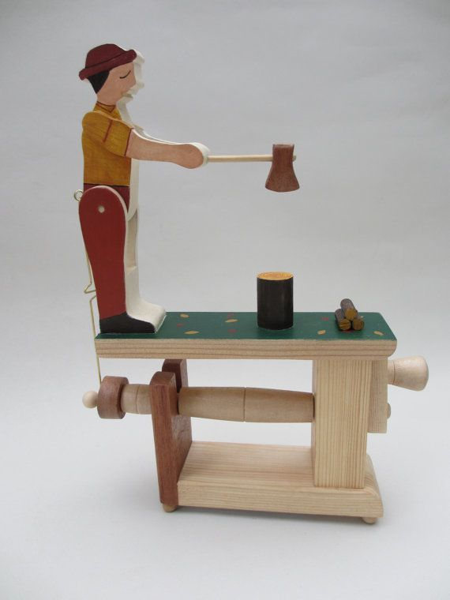
knitr::include_graphics("images/02_hisashige.jpg")
```

## Автомат

Мы будем считать автоматами абстрактные машины, которые принимают разные состояния, а изменение состояний вызывается некоторым действием.
```{r 04_light_switch, eval = FALSE}
grViz('
  digraph G { rankdir="LR"
  node [fontname="Brill",shape=circle,fontsize=14,fixedsize=true]
  edge [fontname="Brill",fontsize=18]
  0 [label="0"];
  1 [label="1"];
  0 -> 1 [label="вверх"];
  0 -> 0 [label="вниз"];
  1 -> 1 [label="вверх"];
  1 -> 0 [label="вниз"];
}') 
```

```{r, out.width="55%", out.height="40%", fig.show='hold', fig.align='center'}
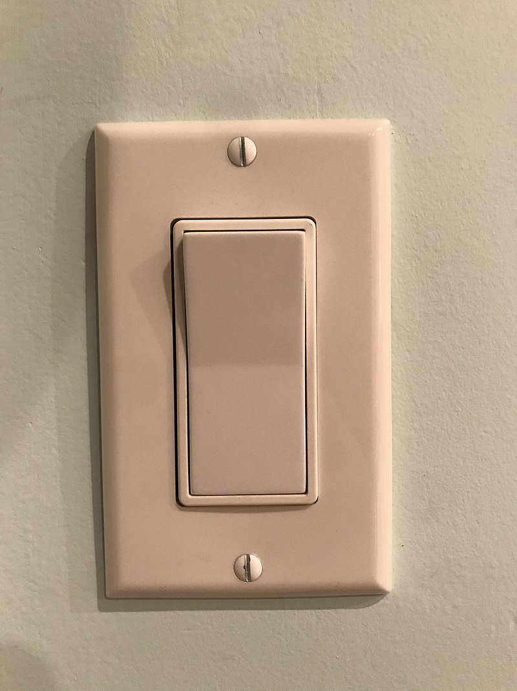
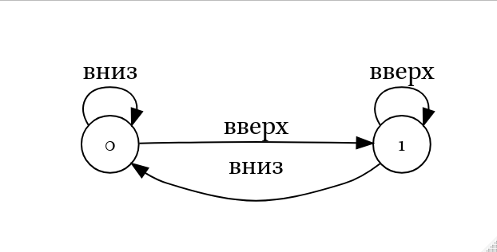
```

## Автомат

Мы будем считать автоматами абстрактные машины, которые принимают разные состояния, а изменение состояний вызывается некоторым действием.

```{r 06_turnstile, eval = FALSE}
grViz('
  digraph G { rankdir="LR"
  node [fontname="Brill",shape=circle,fontsize=14,fixedsize=true]
  edge [fontname="Brill",fontsize=16]
  0 [label="закр."];
  1 [label="откр."];
  0 -> 1 [label="пропуск"];
  0 -> 0 [label="толчок"];
  1 -> 1 [label="пропуск"];
  1 -> 0 [label="толчок"];
}') 
```

```{r, out.width="55%", out.height="40%", fig.show='hold', fig.align='center'}
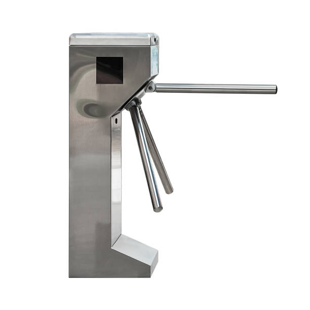
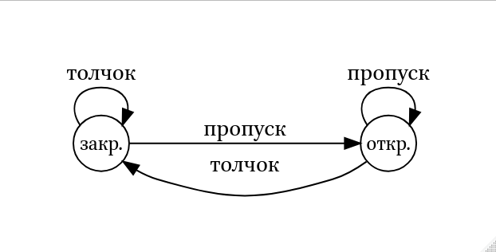
```

## Конечный автомат

Конечный автомат --- разновидность автоматов у которого есть:

* алфавит, который автомат понимает;
* конечное количество состояний;
* переходы между состояниями;
* одно начальное состояние (часто обозначют нулем);
* набор конечных состояний (часто обозначают двойным кружочком).

```{r, out.width="55%", out.height="40%", fig.show='hold', fig.align='center'}


```

## Конечный автомат

Конечные автоматы можно использовать для верефикации поданного на вход слов:

```{r 07_elephant, eval = FALSE}
grViz('
  digraph G { rankdir="LR"
  node [fontname="Brill",shape=circle,fontsize=14,fixedsize=true]
  edge [fontname="Brill",fontsize=16]
  0 [label="0"];
  1 [label="1"];
  2 [label="2"];
  3 [label="3"];
  4 [label="4: ✔️",shape=doublecircle];
  5 [label="5: ✘",shape=doublecircle];
  0 -> 1 [label="с"];
  0 -> 5 [label="не с"];
  1 -> 2 [label="л"];
  1 -> 5 [label="не л"];
  2 -> 3 [label="о"];
  2 -> 5 [label="не о"];
  3 -> 4 [label="н"];
  3 -> 5 [label="не н"];
}') 
```

```{r, fig.align='center', out.width="100%"}
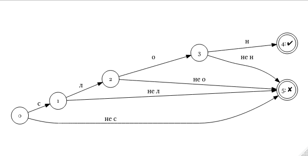
```

## Конечный автомат

Мы будем использовать такую нотацию:

```{r 08_elephant, eval=FALSE}
grViz('
  digraph G { rankdir="LR"
  node [fontname="Brill",shape=circle,fontsize=14,fixedsize=true]
  edge [fontname="Brill",fontsize=16]
  0 [label="0"];
  1 [label="1"];
  2 [label="2"];
  4 [label="️4",shape=doublecircle];
  0 -> 1 [label="с"];
  1 -> 2 [label="л"];
  2 -> 3 [label="о"];
  3 -> 4 [label="н"];
}') 
```

```{r, fig.align='center', out.width="100%"}
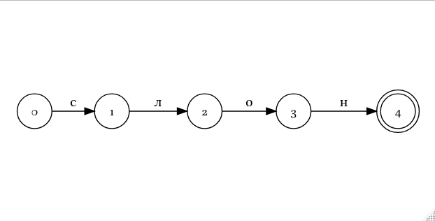
```


## Конечный автомат

Пустой переход обозначают греческой буквой ε:

```{r 09_elephant, eval=FALSE}
grViz('
  digraph G { rankdir="LR"
  node [fontname="Brill",shape=circle,fontsize=14,fixedsize=true]
  edge [fontname="Brill",fontsize=16]
  0 [label="0"];
  1 [label="1"];
  2 [label="2"];
  4 [label="️4"];
  5 [label="5",shape=doublecircle];
  6 [label="6",shape=doublecircle];
  0 -> 1 [label="с"];
  1 -> 2 [label="л"];
  2 -> 3 [label="о"];
  3 -> 4 [label="н"];
  4 -> 5 [label="ε"];
  4 -> 6 [label="ы"];
}') 
```

```{r, fig.align='center', out.width="100%"}
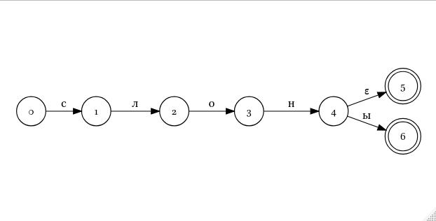
```

## Конечный автомат

Мы можем соединить два автомата:

```{r 10_merged_dfa, eval=FALSE}
grViz('
  digraph G { rankdir="LR"
  node [fontname="Brill",shape=circle,fontsize=14,fixedsize=true]
  edge [fontname="Brill",fontsize=16]
  0 [label="0"];
  1 [label="1"];
  2 [label="2"];
  4 [label="️4"];
  5 [label="5",shape=doublecircle];
  6 [label="6",shape=doublecircle];
  7 [label="7"];
  8 [label="8"];
  9 [label="9"];
  10 [label="10"];
  11 [label="11",shape=doublecircle];
  12 [label="12",shape=doublecircle];
  0 -> 1 [label="с"];
  1 -> 2 [label="л"];
  2 -> 3 [label="о"];
  3 -> 4 [label="н"];
  4 -> 5 [label="ε"];
  4 -> 6 [label="ы"];
  0 -> 7 [label="к"];
  7 -> 8 [label="р"];
  8 -> 9 [label="а"];
  9 -> 10 [label="б"];
  10 -> 11 [label="ε"];
  10 -> 12 [label="ы"];
}') 
```

```{r, fig.align='center', out.width="100%"}
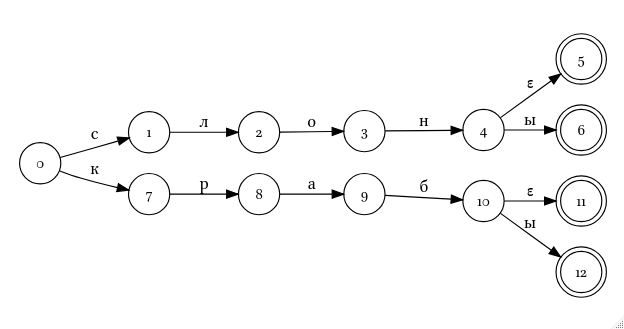
```

## Конечный автомат

Любой конечный автомат можно автоматически минимизировать до оптимального количество состояний: 

```{r 11_merged_dfa, eval=FALSE}
grViz('
  digraph G { rankdir="LR"
  node [fontname="Brill",shape=circle,fontsize=14,fixedsize=true]
  edge [fontname="Brill",fontsize=16]
  0 [label="0"];
  1 [label="1"];
  2 [label="2"];
  4 [label="️4"];
  5 [label="5",shape=doublecircle];
  6 [label="6",shape=doublecircle];
  7 [label="7"];
  8 [label="8"];
  9 [label="9"];
  0 -> 1 [label="с"];
  1 -> 2 [label="л"];
  2 -> 3 [label="о"];
  3 -> 4 [label="н"];
  4 -> 5 [label="ε"];
  4 -> 6 [label="ы"];
  0 -> 7 [label="к"];
  7 -> 8 [label="р"];
  8 -> 9 [label="а"];
  9 -> 4 [label="б"];
}') 
```

```{r, fig.align='center', out.width="100%"}
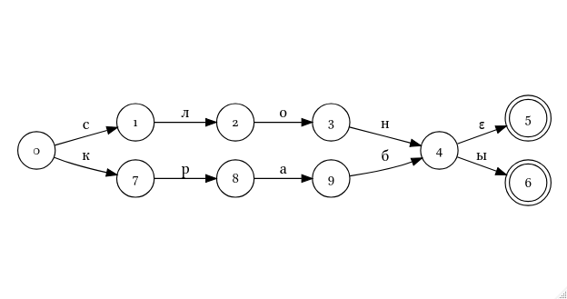
```

# Задачи

## Задачи 

Может ли конечный автомат отличить последовательности символов *a* и *b*, в которых число символов *а* четное?

| пример | ответ |
|--------|-------|
| bbbbb  | да    |
| bbbbba | нет   |
| babbba | да    |
| aa     | да    |
| ab     | нет   |
| aaaaaa | да    |

## Задачи

Может ли конечный автомат отличить последовательности символов *a* и *b*, в которых число символов *а* четное?

```{r 12_odd_a, eval=FALSE}
grViz('
  digraph G { rankdir="LR"
  node [fontname="Brill",shape=circle,fontsize=14,fixedsize=true]
  edge [fontname="Brill",fontsize=16]
  0 [label="0",shape=doublecircle];
  1 [label="1"];
  0 -> 1 [label="a"];
  1 -> 0 [label="a"];
  0 -> 0 [label="b"];
  1 -> 1 [label="b"];
}') 
```

```{r, fig.align='center', out.width="60%"}
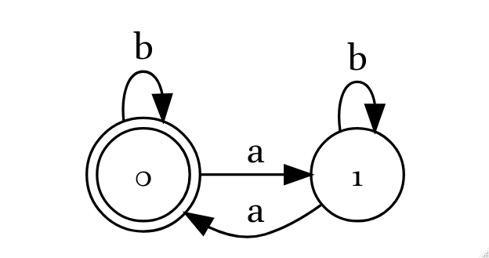
```

## Задачи 

Может ли конечный автомат отличить последовательности символов *a* и *b*, в которых число *а* равно трем?

| пример | ответ |
|--------|-------|
| bb     | нет   |
| ababb  | нет   |
| aaabb  | да    |
| abbaa  | да    |
| ba     | нет   |
| babaa  | да    |


## Задачи 

Может ли конечный автомат отличить последовательности символов *a* и *b*, в которых число *а* равно трем?

```{r 13_three_a, eval=FALSE}
grViz('
  digraph G { rankdir="LR"
  node [fontname="Brill",shape=circle,fontsize=14,fixedsize=true]
  edge [fontname="Brill",fontsize=16]
  0 [label="0"];
  1 [label="1"];
  2 [label="2"];
  3 [label="3",shape=doublecircle];
  0 -> 0 [label="b"];
  1 -> 1 [label="b"];
  2 -> 2 [label="b"];
  3 -> 3 [label="b"];
  0 -> 1 [label="a"];
  1 -> 2 [label="a"];
  2 -> 3 [label="a"];
}') 
```

```{r, fig.align='center', out.width="100%"}
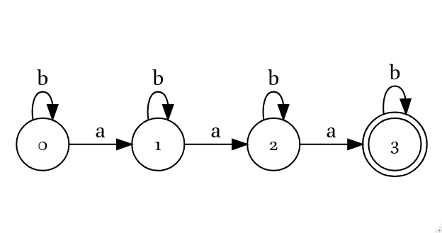
```

## Задачи

Может ли конечный автомат отличить палиндром от других последовательностей символов? 

| пример | ответ |
|--------|-------|
| довод  | да    |
| доход  | да    |
| показ  | нет   |
| кабак  | да    |
| козёл  | нет   |
| комок  | да    |
| потоп  | да    |
| шабаш  | да    |

## Задачи

Может ли конечный автомат отличить палиндром от других последовательностей символов? 

* Конечный автомат должен иметь **конечное** количество состояний.
* Палиндромов бесконечное количество.
* Конечные автоматы нигде не хранят информацию о предыдущих состояниях.
* Предположим, что такой автомат существует. Тогда мы сможем становить автомат на середине двух палиндромов *x* и *y*, перепутать их вторые части и автомат должен будет сказать, что это палиндром.

|   | первая половина | вторая половина |              |
|---|----------------:|-----------------|--------------|
| x |           11011 | 11011           | палиндром    |
| y |           10001 | 10001           | палиндром    |
| z |           11011 | 10001           | не палиндром |

# Трансдьюсеры

## Трансдьюсеры

Трансдьюсеры (в русской [википедии](https://ru.wikipedia.org/wiki/%D0%9A%D0%BE%D0%BD%D0%B5%D1%87%D0%BD%D1%8B%D0%B9_%D0%B0%D0%B2%D1%82%D0%BE%D0%BC%D0%B0%D1%82_%D1%81_%D0%B2%D1%8B%D1%85%D0%BE%D0%B4%D0%BE%D0%BC) они названы конечными автоматами с выходом) -- это такие конечные автоматы, которые имеют дополнительный выходной алфавит и функции выхода.

```{r 14_transducer, eval=FALSE}
grViz('
  digraph G { rankdir="LR"
  node [fontname="Brill",shape=circle,fontsize=14,fixedsize=true]
  edge [fontname="Brill",fontsize=16]
  0 [label="0"];
  1 [label="1"];
  2 [label="2"];
  4 [label="️4"];
  5 [label="5",shape=doublecircle];
  6 [label="6",shape=doublecircle];
  7 [label="7"];
  8 [label="8"];
  9 [label="9"];
  0 -> 1 [label="с:c"];
  1 -> 2 [label="л:л"];
  2 -> 3 [label="о:о"];
  3 -> 4 [label="н:н"];
  4 -> 5 [label="ε:И. п. е. ч."];
  4 -> 6 [label="ы:И. п. м. ч."];
  0 -> 7 [label="к:к"];
  7 -> 8 [label="р:р"];
  8 -> 9 [label="а:а"];
  9 -> 4 [label="б:б"];
}') 
```

```{r, fig.align='center', out.width="100%"}
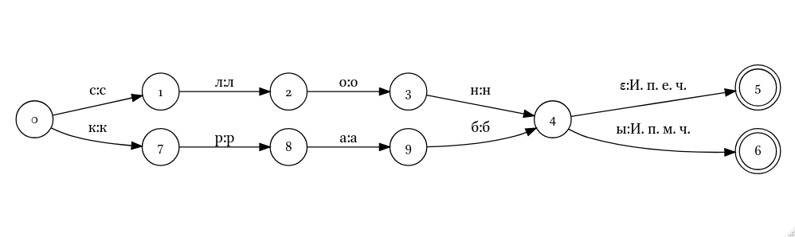
```

## Трансдьюсеры в лингвистике используют для

* морфологического анализа:

слонами → слон<Тв. п. м. ч>.

* транслитерации/транскрипции:

слонами → [slanamʲɪ]

* предективного ввода

сло... → слово, словно, сложный, сложиться...

* в системах проверки правописания

сланами → слонами?

* в системах автоматического перевода близкородственных языков

слонами → слон<Тв. п. м. ч> → elephant<Тв. п. м. ч> → 

→ słoń<Тв. п. м. ч> → słoniami

## Полезные свойства трансдьюсеров

* трансдьюсеры обратимы
* трансдьюсеры можно оптимизировать
* трансдьюсеры могут быть взвешеными
* трансдьюсеры можно соединять между собой (конкатенация, композиция, объединение)


## {}

\LARGE Спасибо за внимание!

\normalsize А еще спасибо Нику Хауэллуǃ
